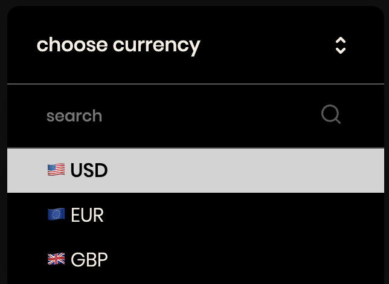

# Currency Wallet

The Currency Wallet application is a financial tracking tool that allows users to manually input their historical transactions involving various currencies. It utilizes APIs to fetch the historical exchange rates for each transaction date, providing an accurate financial overview. The application then displays a chart showing the profit or loss for each transaction, calculated based on current currency rates, enabling users to assess their investment performance over time.

**Main features**:

1. **API Rate Fetching**
   - Integrates with APIs for real-time and historical currency exchange rates.
   - Ensures accurate financial data for each transaction.

2. **Live Transaction Validation**
   - Performs live validation during transaction entry.

3. **ChartJS 2 Integration**
   - Uses ChartJS 2 for visual representation of financial data.
   - Provides clear, interactive charts to display profit or loss.

4. **Redux Toolkit**
   - Employs Redux Toolkit for efficient state management.

5. **Dark Mode**
   - Offers a user-friendly dark mode.
   - Reduces eye strain and provides an alternative aesthetic.

6. **Custom Hooks for Form**
   - Custom hooks enhance form handling and selection options.

7. **Local Storage**
   - Stores user data and preferences locally.
   - Allows for persistent user experiences and quick data retrieval.

&nbsp;

## 💡 Technologies


&nbsp;

## 💿 Installation

The project uses [node](https://nodejs.org/en/) and [npm](https://www.npmjs.com/). After ensuring they are installed, follow these steps:

1. **Install Dependencies**
   - Open your terminal.
   - Navigate to the project's root directory.
   - Type `npm i` to install the necessary packages.

2. **API Key Setup**
   - Obtain an API key from [API Layer's Exchange Rates](https://api.apilayer.com/exchangerates_data).
   - In the `src` folder of the project, create a file named `API_KEY.js`.
   - Inside `API_KEY.js`, export the API key as follows:

     ```javascript
     const API_KEY = 'your_api_key_here';
     export default API_KEY;
     ```

   - Replace `your_api_key_here` with the actual API key you obtained.

By following these steps, you will set up the necessary environment and API access for the application.


&nbsp;

## 🤔 Solutions provided in the project

**Custom Hook for the form component**

```javascript 
function useForm() {
    const { formData, formErrors } = useSelector((store) => store.form);
    const { loading, error: fetchError } = useSelector((store) => store.currency.historical);
    const dispatch = useDispatch();

    useEffect(() => {
        if (formData.date !== '' && formData.currency !== '') {
            const [dateString] = formData.date.split('T');
            const [_, currencyString] = formData.currency.split(' ');

            dispatch(fetchRates({ currency: currencyString, date: dateString, dataType: 'historical' }));
        }
    }, [formData.date, formData.currency]);

    const liveValidation = (input) => {
        const { name } = input;
        const errorInState = formErrors[name];
        if (!errorInState) return;

        const inputError = h.validate(db.formFields, [input]);
        const isErrorObjEmpty = h.isObjectEmpty(inputError);
        if (!isErrorObjEmpty) return;

        dispatch(formActions.removeError({ name }));
    };

    const handleCustomInputSelection = (name, value) => {
        dispatch(formActions.setFormData({ name, value }));
        dispatch(formActions.removeError({ name }));
    };

    const handleSubmit = (e) => {
        e.preventDefault();

        const form = e.target;

        // input validation
        const inputElements = h.findInputElementsInForm(form);
        const fieldErrors = h.validate(db.formFields, inputElements);

        // custom validation
        const customInputsErrors = h.customValidation(db.formFields, formData);
        const updatedErrors = { ...fieldErrors, ...customInputsErrors };

        dispatch(formActions.setErrors(updatedErrors));

        const isFormClean = h.checkErrors([formErrors, updatedErrors]);
        if (!isFormClean) {
            return;
        }

        dispatch(transactionsActions.addTransaction({ transaction: formData }));
        dispatch(formActions.resetForm());
    };

    const handleFetchErrorReset = () => {
        dispatch(currencyActions.resetFetchError({ dataType: 'historical' }));
    };

    const handleFieldChange = (e) => {
        const { name, value } = e.target;
        dispatch(formActions.setFormData({ name, value }));
        liveValidation(e.target);
    };

    return {
        formData,
        formErrors,
        loading,
        fetchError,
        liveValidation,
        handleCustomInputSelection,
        handleSubmit,
        handleFetchErrorReset,
        handleFieldChange,
    };
}

```

&nbsp;

-   **Custom Select**: Offers both search and select function with keys.



&nbsp;

## 💭 Possible future features

-   **Filtering by month/year, biggest gain/loss**

&nbsp;

## 🙋‍♂️ Feel free to contact me

Write sth nice ;) Find me on [LinkedIn ](https://www.linkedin.com/in/marcin-kulbicki-426817a4/) or [Instagram](https://www.instagram.com/yakksiek/)

&nbsp;

## 👏 Thanks / Special thanks / Credits

Thanks to my [Mentor - devmentor.pl](https://devmentor.pl/) – for providing me with this task and for code review.
